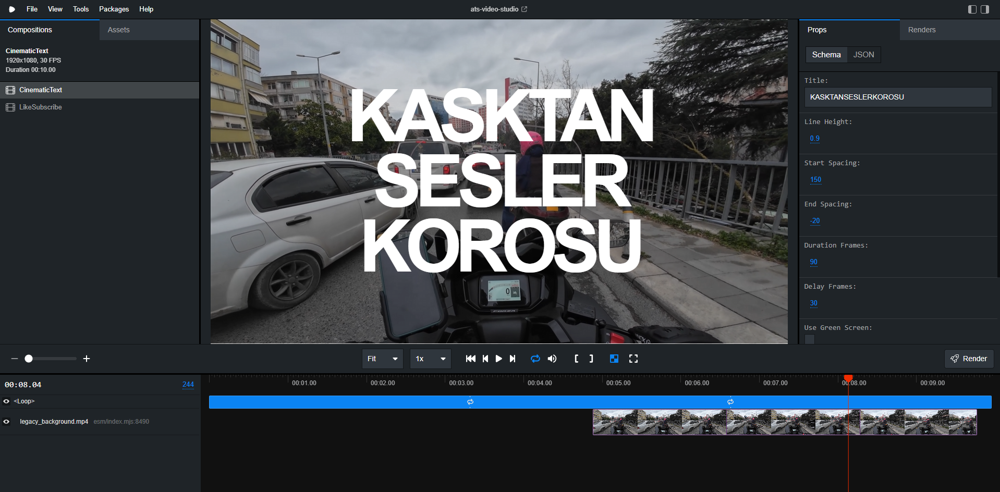

# ATS Video Studio

A powerful video manipulation and effect tool built with [React](https://reactjs.org/) and [Remotion](https://www.remotion.dev/). Create programmatic videos, cinematic text effects, and animations with ease.



## Features

- **Cinematic Text Effects**: Create stunning, animated text reveals with customizable timing and spacing.
- **Interactive Editing**: Adjust properties in real-time using the Remotion Studio sidebar.
  - **Text Content**: Full support for multi-line text.
  - **Styling**: Control line height, letter spacing (start/end), and blur.
  - **Timing**: Fine-tune animation duration and delay.
- **Green Screen Mode**: Toggle a solid background color (default green) for chroma key workflows.
- **Custom Backgrounds**:
  - Use the built-in video background.
  - Upload your own video to the `public/` folder and reference it by filename.
  - Use external URLs for background videos.

## Getting Started

### Prerequisites

- [Node.js](https://nodejs.org/) installed on your machine.
- [FFmpeg](https://ffmpeg.org/) (optional, for rendering).

### Installation

1.  Clone the repository:
    ```bash
    git clone https://github.com/ateshai/ats-video-studio.git
    cd ats-video-studio
    ```

2.  Install dependencies:
    ```bash
    npm install
    ```

## Usage

### Development Server

Start the Remotion Studio to preview and edit your video:

```bash
npm start
```

This will open the studio at `http://localhost:3000`.

### Rendering

To render your video to an MP4 file:

```bash
npm run build
```

Or render a specific composition:

```bash
npx remotion render src/index.ts CinematicText out.mp4
```

## Project Structure

- **`src/`**: Source code for compositions and components.
  - **`TextEffects/CinematicText.tsx`**: Main text effect component with Zod schema for props.
  - **`Root.tsx`**: Registers compositions and defines default props.
- **`public/`**: Static assets (videos, images).
